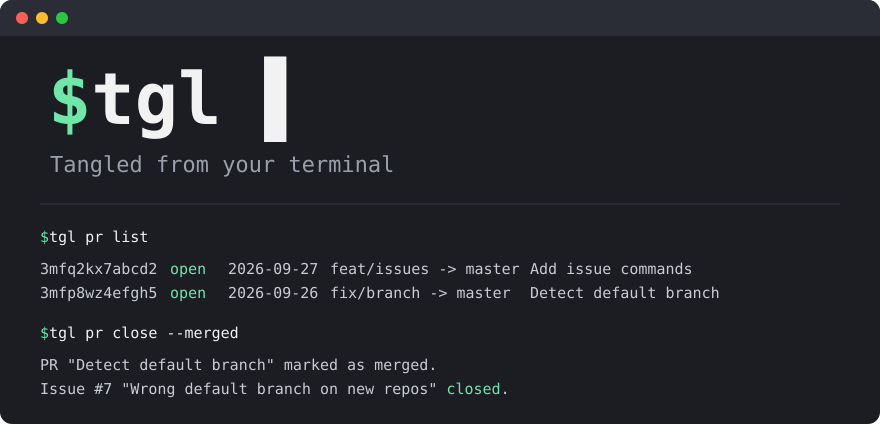

# tangled-cli (`tgl`)

[Español](README.es.md)



A command-line tool for [Tangled](https://tangled.org), in the style of GitHub's `gh`.

## What it's for

Manage a Tangled repository without leaving the terminal: open, list, check out, comment
on and close pull requests; create and follow issues; and attach files (such as a signed
build) to a release.

It suits repos mirrored on GitHub and Tangled: open the PR on both, merge locally, push
once, and mark the Tangled PR as merged with `tgl`.

No third-party dependencies: only Node.js 20+ and git. MIT licensed.

## Install

```bash
git clone https://tangled.org/did:plc:e6a2dywiq22fgtsjrujrkift tangled-cli
cd tangled-cli
npm link
```

`npm link` makes the `tgl` command available in any terminal. Check it with `tgl --version`.

## Log in

1. Create an **app password** for your account (not your main password). In the Bluesky
   app it is under Settings → Privacy and security → App passwords. Any AT Protocol
   account works.
2. Run `tgl auth login` and paste it when asked.

It is kept in your system's secret store (Windows DPAPI, macOS Keychain, Linux secret
service), never in a repository. `tgl auth logout` deletes it.

## Use

Run `tgl` inside a git repo with a Tangled remote:

```bash
tgl pr create -t "Add dark mode" -b "Adds a dark theme"
tgl pr list
tgl pr close <id> --merged
tgl issue list
tgl release upload v1.2.0 build.zip
```

Every command has `--help`. The full list, options and how `tgl` works are in the
[reference](docs/reference.md).

## Repositories

The same code lives on both forges; either works for issues and PRs.

- Tangled: https://tangled.org/did:plc:e6a2dywiq22fgtsjrujrkift
- GitHub (mirror): https://github.com/OviiiOne/tangled-cli

## License

[MIT](LICENSE)
